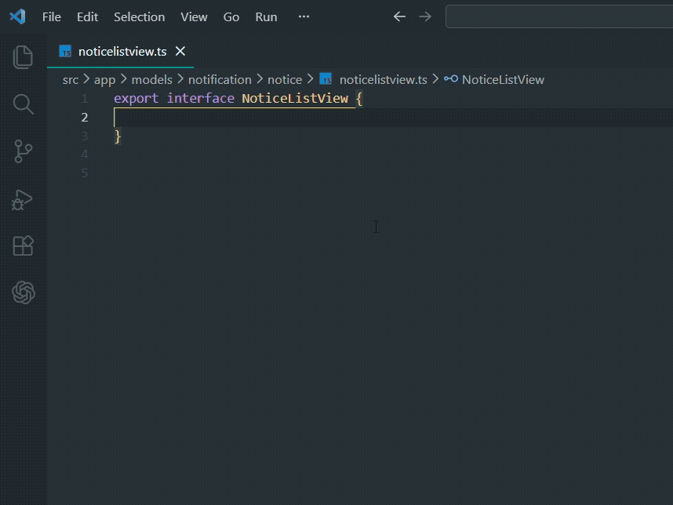
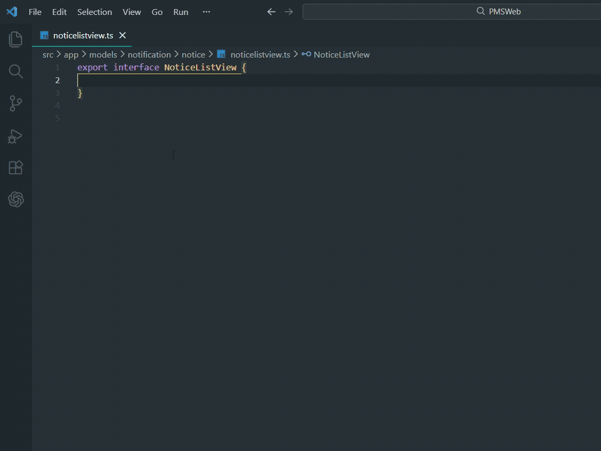

# C# Model to TypeScript Converter

Instantly convert C# model properties to TypeScript interface properties right inside VS Code.

## Demo

### Right-click Context Menu


### Command Palette


## Features

- Convert C# auto-properties to TypeScript properties with a single click
- Right-click context menu support
- Handles nullable types, collections, DateTime, and more

## Usage

1. Select your C# model properties in the editor
2. Right-click and choose **"Convert C# to TypeScript"**
3. Or press `Ctrl+Shift+P` and search **"Convert C# to TypeScript"**

### Before (C#)

```csharp
public int Noticeid { get; set; }
public string Noticecode { get; set; }
public string Noticetitle { get; set; }
public DateTime? Scheduledatetime { get; set; }
public string? Modifiedbyname { get; set; }
public int? Modifiedby { get; set; }
public DateTime Createdon { get; set; }
public int Status { get; set; }
```

### After (TypeScript)

```typescript
Noticeid: number;
Noticecode: string;
Noticetitle: string;
Scheduledatetime: Date | string | null;
Modifiedbyname: string | null;
Modifiedby: number | null;
Createdon: Date | string;
Status: number;
```

## Supported Type Mappings

| C# Type | TypeScript Type |
|---|---|
| `int`, `long`, `float`, `double`, `decimal`, `short`, `byte` | `number` |
| `string`, `char`, `Guid` | `string` |
| `bool` | `boolean` |
| `DateTime`, `DateTimeOffset` | `Date \| string` |
| `object`, `dynamic` | `any` |
| Nullable (`Type?`) | adds `\| null` |
| `List<T>`, `IEnumerable<T>`, `T[]` | `T[]` |
| `Dictionary<K,V>` | `Record<K, V>` |
| Custom types | passed through as-is |
